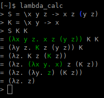
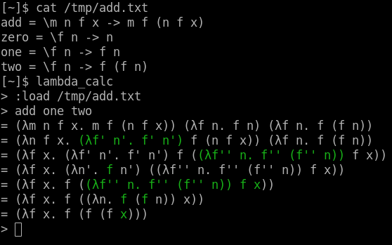
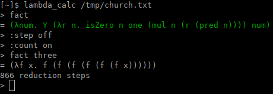
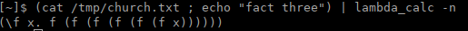

An untyped lambda calculus interpreter.

It has several useful features:

    - Has support for the usual implicit parenthesization rules of lambda calculus

        - See the documentation for the `parse` function [on here](https://docs.rs/lambda_calc)).

    - Highlights the expression reduced last at each beta reduction step

        - (Can be disabled.)

    - Allows bind lambda terms to symbols (definitions)

        - Lazy symbol substitution

        - Allows recursive definitions

    - Has context-sensitive TAB completion, matching brace highlighter, and history support
(thanks to [rustyline](https://crates.io/crates/rustyline)).

    - Allows escaping line breaks with `&`

        - The line will be saved to history as a single line.

    - Has a non-interactive mode whose output is in a can be easily parsed by scripts

    - Allows counting the number of reduction steps

...along with many other features; run with `--help` for more.

## Screenshots









## Installation

[Install cargo](https://doc.rust-lang.org/cargo/getting-started/installation.html)
if you don't have it, then run

```
$ cargo install lambda_calc
```

This will install the `lambda_calc` binary.
Opitonally, you may use the `--root` option to install to a different directory;
run `man cargo-install` for details.
