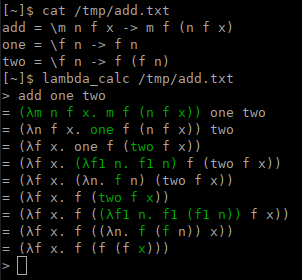

An untyped lambda calculus interpreter.

It has support for usual rules of implicit parenthesization of lambda calculus
(see [this](https://docs.rs/lambda_calc)), and shows each beta reduction
step by step, highlighting the expression reduced last.

## Screenshots




## Installation

[Install cargo](https://doc.rust-lang.org/cargo/getting-started/installation.html)
if you don't have it, then run

```
$ cargo install lambda_calc
```

This will install the `lambda_calc` binary.
